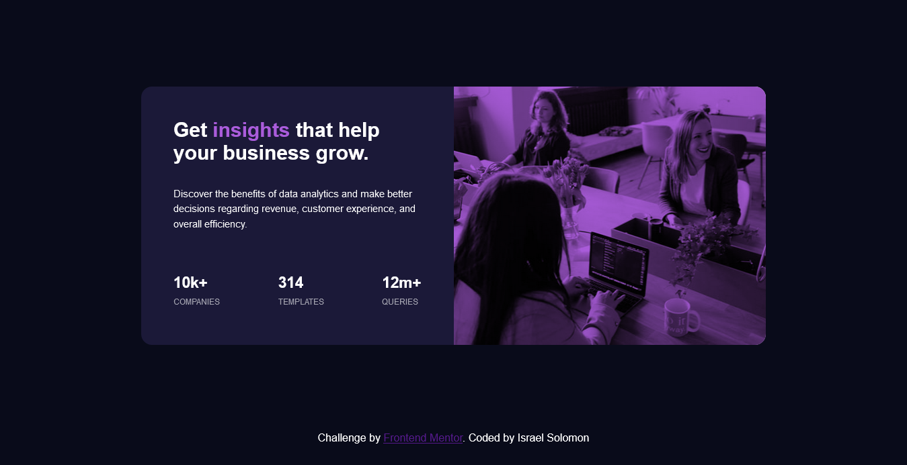

# Frontend Mentor - Stats preview card component solution

This is a solution to the [Stats preview card component challenge on Frontend Mentor](https://www.frontendmentor.io/challenges/stats-preview-card-component-8JqbgoU62). 
Frontend Mentor challenges help you improve your coding skills by building realistic projects. 

## Table of contents

- [Overview](#overview)
  - [The challenge](#the-challenge)
  - [Screenshot](#screenshot)
  - [Links](#links)
- [My process](#my-process)
  - [Built with](#built-with)
  - [What I learned](#what-i-learned)
  - [Useful resources](#useful-resources)
- [Author](#author)

## Overview

### The challenge

Users should be able to:

- View the optimal layout depending on their device's screen size

### Screenshot



### Links
- Live Site URL: (https://main-card-component.netlify.app/)

## My process

### Built with

- Semantic HTML5 markup
- CSS custom properties
- Flexbox
- Desktop first workflow

### What I learned

The mobile view of the project changes the order of the elements in the page. It adds to my knowledge to get the syntax used in re-ordering the page for the mobile view.
```
.text__section {
    order:2;
} 
```
Changing the background color of the image thereby making the image blend with the background color of the section where the image is located.
```
.pics__section{
    background-blend-mode: multiply;
}
```

### Useful resources

- (https://www.w3schools.com) - This helped me for the re-ordering for the mobile design and also the blend mode for the image and the section background color.

## Author

- Frontend Mentor - [@Soulz001](https://www.frontendmentor.io/profile/Soulz001)
- Twitter - [@amIsraelSolomon](https://www.twitter.com/amIsraelSolomon)

